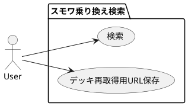
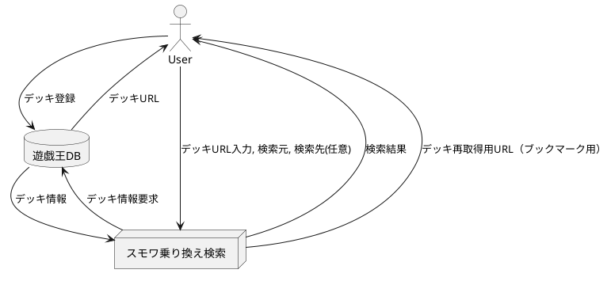
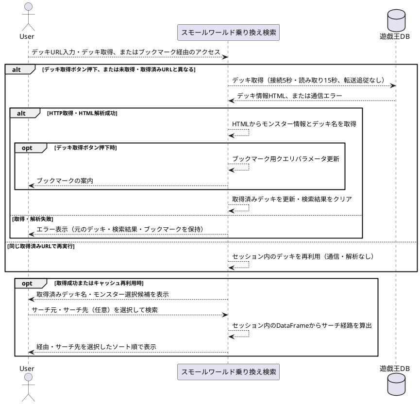
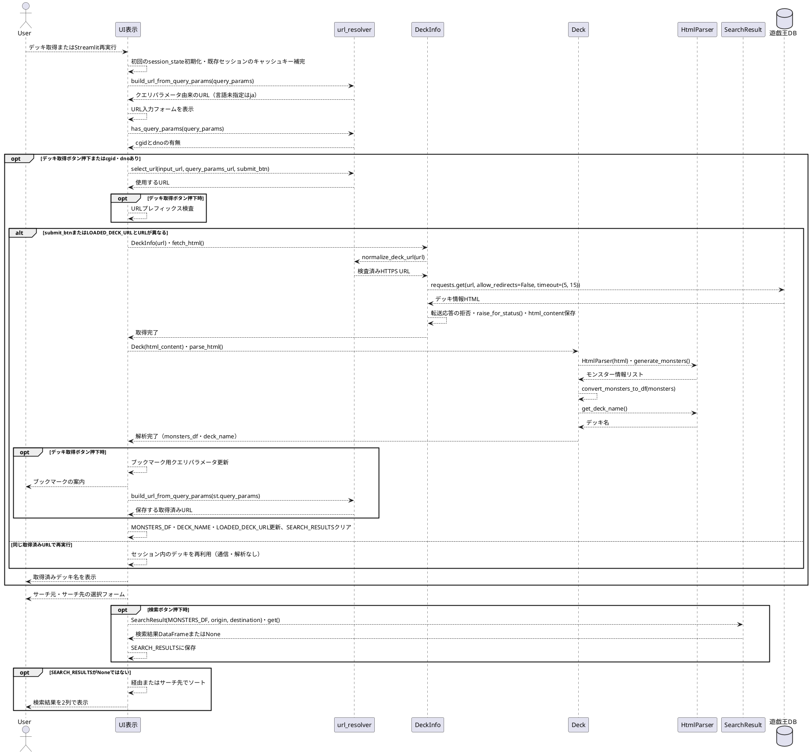
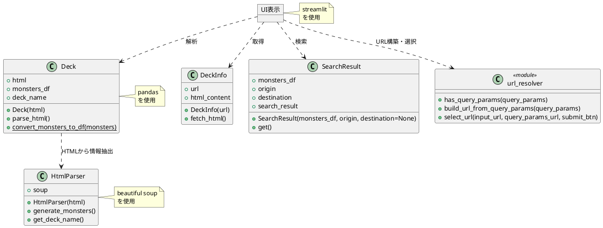
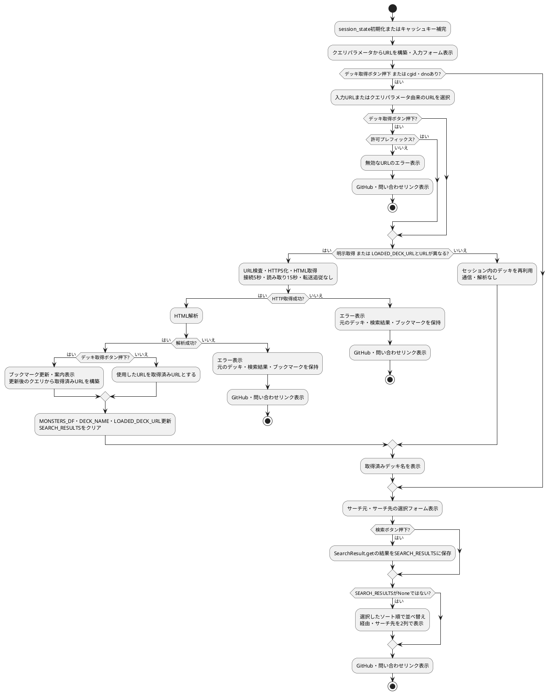

# ygo-small-world-transit

## 要件定義

```plantuml
@startuml
left to right direction
:User: as user

package "スモワ乗り換え検索" {
    (検索) as uc1
    (デッキ再取得用URL保存) as uc2
}
user --> uc1
user --> uc2

@enduml
```

1. スモールワールドのサーチ先が検索できる
1. 遊戯王DBからデッキレシピを読み込める
1. PC/スマートフォンでの表示に対応
1. 読み込んだデッキを再取得するためのURLをブックマークできる

ブックマーク用URLには `cgid`、`dno`、`request_locale` を保存する。サーチ元・サーチ先の選択と検索結果はURLには保存しない。

## データフロー図

```plantuml
@startuml
actor User as user
database 遊戯王DB as db
node "スモワ乗り換え検索" as sw

user --> db : デッキ登録
db --> user : デッキURL
user --> sw : デッキURL入力, 検索元, 検索先(任意)
sw --> user : 検索結果
sw --> db : デッキ情報要求
db --> sw : デッキ情報
sw --> user : デッキ再取得用URL（ブックマーク用）
@enduml
```

## シーケンス図

### 概略版

```plantuml
@startuml
actor "User" as user
participant "スモールワールド乗り換え検索" as sw
database "遊戯王DB" as db
    user --> sw : デッキURL入力・デッキ取得、またはブックマーク経由のアクセス
    alt デッキ取得ボタン押下、または未取得・取得済みURLと異なる
        sw --> db : デッキ取得（接続5秒・読み取り15秒、転送追従なし）
        db --> sw : デッキ情報HTML、または通信エラー
        alt HTTP取得・HTML解析成功
            sw --> sw : HTMLからモンスター情報とデッキ名を取得
            opt デッキ取得ボタン押下時
                sw --> sw : ブックマーク用クエリパラメータ更新
                sw --> user : ブックマークの案内
            end
            sw --> sw : 取得済みデッキを更新・検索結果をクリア
        else 取得・解析失敗
            sw --> user : エラー表示（元のデッキ・検索結果・ブックマークを保持）
        end
    else 同じ取得済みURLで再実行
        sw --> sw : セッション内のデッキを再利用（通信・解析なし）
    end
    opt 取得成功またはキャッシュ再利用時
        sw --> user : 取得済みデッキ名・モンスター選択候補を表示
        user --> sw : サーチ元・サーチ先（任意）を選択して検索
        sw --> sw : セッション内のDataFrameからサーチ経路を算出
        sw --> user : 経由・サーチ先を選択したソート順で表示
    end
@enduml
```

### ソフトウェア詳細版

以下はデッキ取得・解析・検索の正常系を示す。**デッキ取得ボタン押下時は同じURLでも再取得する。それ以外は、`cgid` と `dno` があり、構築したURLが `LOADED_DECK_URL` と異なる場合だけ取得・解析する。** 初回は `LOADED_DECK_URL` が `None` のため取得する。検索・並べ替えなど、同じ取得済みURLでの再実行はセッション内のデッキを再利用する。

HTTP取得には接続5秒・読み取り15秒のタイムアウトを設定し、転送応答には追従しない。取得・解析時の例外は UI で捕捉し、エラーを表示する。**失敗時は元のデッキ情報・検索結果・ブックマークを保持する。**

解析成功後、`MONSTERS_DF`・`DECK_NAME`・`LOADED_DECK_URL` を更新し、`SEARCH_RESULTS` をクリアする。ブックマークの更新と案内はデッキ取得ボタン押下時だけ行う。このとき保存する取得済みURLは更新後のクエリパラメータから構築し、`request_locale` 未指定時の既定値 `ja` と一致させる。キャッシュはセッション単位で、新しいセッションでは再取得する。

```plantuml
@startuml
actor "User" as user
participant "UI表示" as ui
participant "url_resolver" as ur
participant "DeckInfo" as di
participant "Deck" as dc
participant "HtmlParser" as hp
participant "SearchResult" as sr
database "遊戯王DB" as db
    user --> ui : デッキ取得またはStreamlit再実行
    ui --> ui : 初回のsession_state初期化・既存セッションのキャッシュキー補完
    ui --> ur : build_url_from_query_params(query_params)
    ur --> ui : クエリパラメータ由来のURL（言語未指定はja）
    ui --> ui : URL入力フォームを表示
    ui --> ur : has_query_params(query_params)
    ur --> ui : cgidとdnoの有無
    opt デッキ取得ボタン押下またはcgid・dnoあり
        ui --> ur : select_url(input_url, query_params_url, submit_btn)
        ur --> ui : 使用するURL
        opt デッキ取得ボタン押下時
            ui --> ui : URLプレフィックス検査
        end
        alt submit_btnまたはLOADED_DECK_URLとURLが異なる
            ui --> di : DeckInfo(url)・fetch_html()
            di --> ur : normalize_deck_url(url)
            ur --> di : 検査済みHTTPS URL
            di --> db : requests.get(url, allow_redirects=False, timeout=(5, 15))
            db --> di : デッキ情報HTML
            di --> di : 転送応答の拒否・raise_for_status()・html_content保存
            di --> ui : 取得完了
            ui --> dc : Deck(html_content)・parse_html()
            dc --> hp : HtmlParser(html)・generate_monsters()
            hp --> dc : モンスター情報リスト
            dc --> dc : convert_monsters_to_df(monsters)
            dc --> hp : get_deck_name()
            hp --> dc : デッキ名
            dc --> ui : 解析完了（monsters_df・deck_name）
            opt デッキ取得ボタン押下時
                ui --> ui : ブックマーク用クエリパラメータ更新
                ui --> user : ブックマークの案内
                ui --> ur : build_url_from_query_params(st.query_params)
                ur --> ui : 保存する取得済みURL
            end
            ui --> ui : MONSTERS_DF・DECK_NAME・LOADED_DECK_URL更新、SEARCH_RESULTSクリア
        else 同じ取得済みURLで再実行
            ui --> ui : セッション内のデッキを再利用（通信・解析なし）
        end
        ui --> user : 取得済みデッキ名を表示
    end
    ui --> user : サーチ元・サーチ先の選択フォーム
    opt 検索ボタン押下時
        ui --> sr : SearchResult(MONSTERS_DF, origin, destination)・get()
        sr --> ui : 検索結果DataFrameまたはNone
        ui --> ui : SEARCH_RESULTSに保存
    end
    opt SEARCH_RESULTSがNoneではない
        ui --> ui : 経由またはサーチ先でソート
        ui --> user : 検索結果を2列で表示
    end
@enduml
```

## クラス図

```plantuml
@startuml
object "UI表示" as ui
note right
streamlit
を使用
endnote
class DeckInfo{
    + url
    + html_content
    + DeckInfo(url)
    + fetch_html()
}
class SearchResult {
    + monsters_df
    + origin
    + destination
    + search_result
    + SearchResult(monsters_df, origin, destination=None)
    + get()
}
class Deck{
    + html
    + monsters_df
    + deck_name
    + Deck(html)
    + parse_html()
    {static} + convert_monsters_to_df(monsters)
}
note right
pandas
を使用
endnote
class HtmlParser{
    + soup
    + HtmlParser(html)
    + generate_monsters()
    + get_deck_name()
}
note right
beautiful soup
を使用
endnote
class url_resolver <<module>> {
    + has_query_params(query_params)
    + build_url_from_query_params(query_params)
    + select_url(input_url, query_params_url, submit_btn)
}
ui ..> DeckInfo : 取得
ui ..> SearchResult : 検索
ui ..> Deck : 解析
ui ..> url_resolver : URL構築・選択
Deck ..> HtmlParser : HTMLから情報抽出
@enduml
```

`Deck.monsters_df` は `name`、`attribute`、`type`、`level`、`attack`、`defence` の6列を持つ DataFrame。`SearchResult.get()` は `origin`、`transit`、`dest` の3列を持つ DataFrame を返し、サーチ元が見つからない場合は `None` を返す。

## フローチャート

```plantuml
@startuml
start
:session_state初期化またはキャッシュキー補完;
:クエリパラメータからURLを構築・入力フォーム表示;
if (デッキ取得ボタン押下 または cgid・dnoあり?) then (はい)
    :入力URLまたはクエリパラメータ由来のURLを選択;
    if (デッキ取得ボタン押下?) then (はい)
        if (許可プレフィックス?) then (はい)
        else (いいえ)
            :無効なURLのエラー表示;
            :GitHub・問い合わせリンク表示;
            stop
        endif
    endif
    if (明示取得 または LOADED_DECK_URLとURLが異なる?) then (はい)
        :URL検査・HTTPS化・HTML取得\n接続5秒・読み取り15秒・転送追従なし;
        if (HTTP取得成功?) then (はい)
            :HTML解析;
            if (解析成功?) then (はい)
                if (デッキ取得ボタン押下?) then (はい)
                    :ブックマーク更新・案内表示\n更新後のクエリから取得済みURLを構築;
                else (いいえ)
                    :使用したURLを取得済みURLとする;
                endif
                :MONSTERS_DF・DECK_NAME・LOADED_DECK_URL更新\nSEARCH_RESULTSをクリア;
            else (いいえ)
                :エラー表示\n元のデッキ・検索結果・ブックマークを保持;
                :GitHub・問い合わせリンク表示;
                stop
            endif
        else (いいえ)
            :エラー表示\n元のデッキ・検索結果・ブックマークを保持;
            :GitHub・問い合わせリンク表示;
            stop
        endif
    else (いいえ)
        :セッション内のデッキを再利用\n通信・解析なし;
    endif
    :取得済みデッキ名を表示;
endif
:サーチ元・サーチ先の選択フォーム表示;
if (検索ボタン押下?) then (はい)
    :SearchResult.getの結果をSEARCH_RESULTSに保存;
endif
if (SEARCH_RESULTSがNoneではない?) then (はい)
    :選択したソート順で並べ替え\n経由・サーチ先を2列で表示;
endif
:GitHub・問い合わせリンク表示;
stop
@enduml
```

## 開発環境

* python
* github
* streamlit
* requests
* pandas
* beautifulsoup4
* lxml
* numpy
* pytest
* pytest-mock

コーディング規約はPython公式に従う。

https://docs.python.org/ja/3/tutorial/controlflow.html#intermezzo-coding-style
