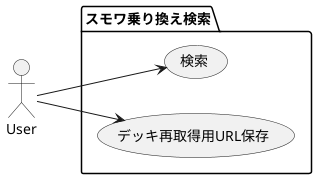
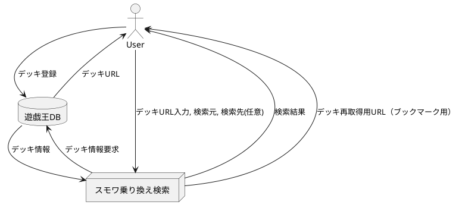
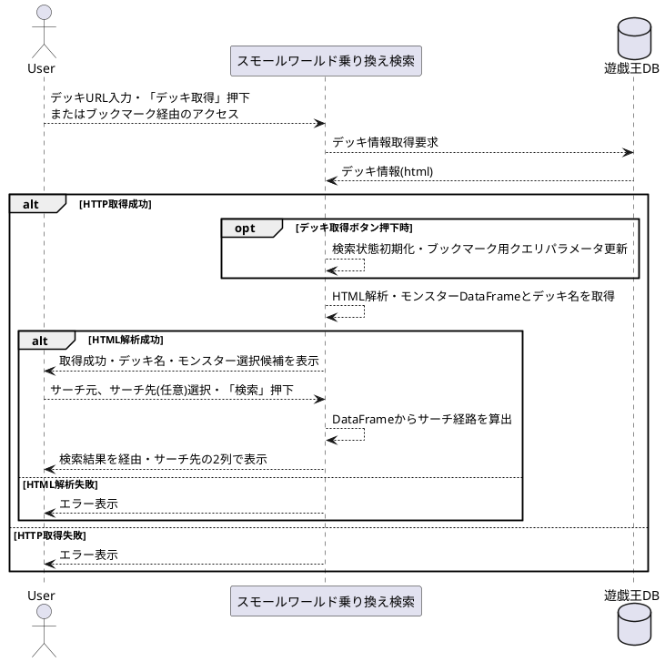
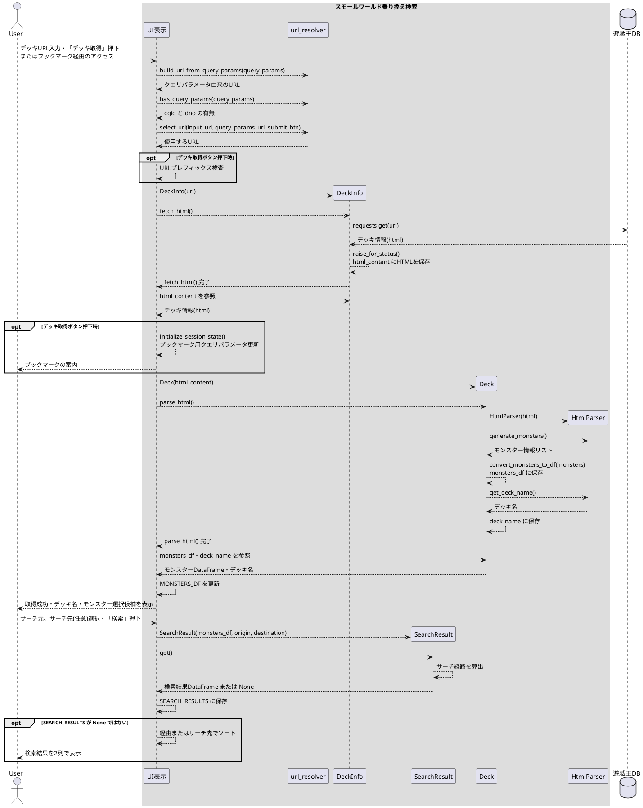
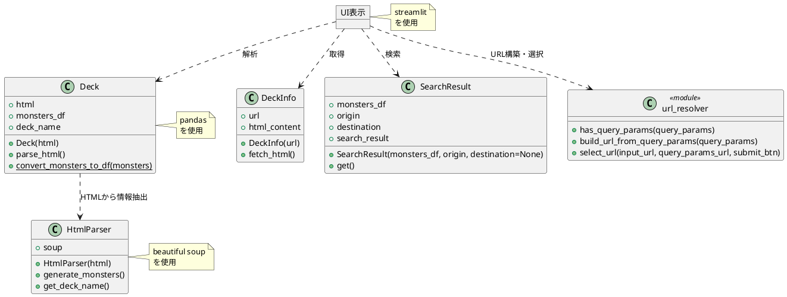
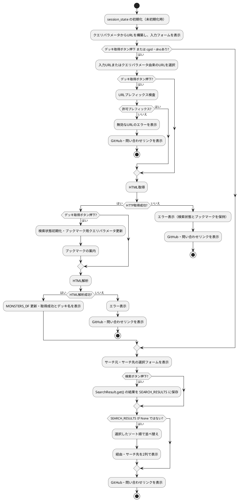

# ygo-small-world-transit

## 要件定義

```plantuml
@startuml
left to right direction
:User: as user

package "スモワ乗り換え検索" {
    (検索) as uc1
    (デッキ再取得用URL保存) as uc2
}
user --> uc1
user --> uc2

@enduml
```

1. スモールワールドのサーチ先が検索できる
1. 遊戯王DBからデッキレシピを読み込める
1. PC/スマートフォンでの表示に対応
1. 読み込んだデッキを再取得するためのURLをブックマークできる

ブックマーク用URLには `cgid`、`dno`、`request_locale` を保存する。サーチ元・サーチ先の選択と検索結果はURLには保存しない。

## データフロー図

```plantuml
@startuml
actor User as user
database 遊戯王DB as db
node "スモワ乗り換え検索" as sw

user --> db : デッキ登録
db --> user : デッキURL
user --> sw : デッキURL入力, 検索元, 検索先(任意)
sw --> user : 検索結果
sw --> db : デッキ情報要求
db --> sw : デッキ情報
sw --> user : デッキ再取得用URL（ブックマーク用）
@enduml
```

## シーケンス図

### 概略版

```plantuml
@startuml
actor User as user
participant "スモールワールド乗り換え検索" as sw
database 遊戯王DB as db

user --> sw : デッキURL入力・「デッキ取得」押下\nまたはブックマーク経由のアクセス
sw --> db : デッキ情報取得要求
db --> sw : デッキ情報(html)
alt HTTP取得成功
    opt デッキ取得ボタン押下時
        sw --> sw : 検索状態初期化・ブックマーク用クエリパラメータ更新
    end
    sw --> sw : HTML解析・モンスターDataFrameとデッキ名を取得
    alt HTML解析成功
        sw --> user : 取得成功・デッキ名・モンスター選択候補を表示
        user --> sw : サーチ元、サーチ先(任意)選択・「検索」押下
        sw --> sw : DataFrameからサーチ経路を算出
        sw --> user : 検索結果を経由・サーチ先の2列で表示
    else HTML解析失敗
        sw --> user : エラー表示
    end
else HTTP取得失敗
    sw --> user : エラー表示
end

@enduml
```

### ソフトウェア詳細版

以下はデッキ取得・解析・検索の正常系を示す。取得・解析時の例外は UI で捕捉し、画面にエラーを表示する。Streamlit の再実行時も、`cgid` と `dno` があればデッキを取得・解析する。

```plantuml
@startuml
actor User as user
box "スモールワールド乗り換え検索"
participant "UI表示" as ui
participant "url_resolver" as ur
participant "DeckInfo" as di
participant "SearchResult" as sr
participant "Deck" as dc
participant "HtmlParser" as hp
end box
database 遊戯王DB as db

user --> ui : デッキURL入力・「デッキ取得」押下\nまたはブックマーク経由のアクセス
ui --> ur : build_url_from_query_params(query_params)
ur --> ui : クエリパラメータ由来のURL
ui --> ur : has_query_params(query_params)
ur --> ui : cgid と dno の有無
ui --> ur : select_url(input_url, query_params_url, submit_btn)
ur --> ui : 使用するURL
opt デッキ取得ボタン押下時
    ui --> ui : URLプレフィックス検査
end
create di
ui --> di : DeckInfo(url)
ui --> di : fetch_html()
di --> db : requests.get(url)
db --> di : デッキ情報(html)
di --> di : raise_for_status()\nhtml_content にHTMLを保存
di --> ui : fetch_html() 完了
ui --> di : html_content を参照
di --> ui : デッキ情報(html)
opt デッキ取得ボタン押下時
    ui --> ui : initialize_session_state()\nブックマーク用クエリパラメータ更新
    ui --> user : ブックマークの案内
end
create dc
ui --> dc : Deck(html_content)
ui --> dc : parse_html()
create hp
dc --> hp : HtmlParser(html)
dc --> hp : generate_monsters()
hp --> dc : モンスター情報リスト
dc --> dc : convert_monsters_to_df(monsters)\nmonsters_df に保存
dc --> hp : get_deck_name()
hp --> dc : デッキ名
dc --> dc : deck_name に保存
dc --> ui : parse_html() 完了
ui --> dc : monsters_df・deck_name を参照
dc --> ui : モンスターDataFrame・デッキ名
ui --> ui : MONSTERS_DF を更新
ui --> user : 取得成功・デッキ名・モンスター選択候補を表示
user --> ui : サーチ元、サーチ先(任意)選択・「検索」押下
create sr
ui --> sr : SearchResult(monsters_df, origin, destination)
ui --> sr : get()
sr --> sr : サーチ経路を算出
sr --> ui : 検索結果DataFrame または None
ui --> ui : SEARCH_RESULTS に保存
opt SEARCH_RESULTS が None ではない
    ui --> ui : 経由またはサーチ先でソート
    ui --> user : 検索結果を2列で表示
end

@enduml
```

## クラス図

```plantuml
@startuml
object "UI表示" as ui
note right
streamlit
を使用
endnote
class DeckInfo{
    + url
    + html_content
    + DeckInfo(url)
    + fetch_html()
}
class SearchResult {
    + monsters_df
    + origin
    + destination
    + search_result
    + SearchResult(monsters_df, origin, destination=None)
    + get()
}
class Deck{
    + html
    + monsters_df
    + deck_name
    + Deck(html)
    + parse_html()
    {static} + convert_monsters_to_df(monsters)
}
note right
pandas
を使用
endnote
class HtmlParser{
    + soup
    + HtmlParser(html)
    + generate_monsters()
    + get_deck_name()
}
note right
beautiful soup
を使用
endnote
class url_resolver <<module>> {
    + has_query_params(query_params)
    + build_url_from_query_params(query_params)
    + select_url(input_url, query_params_url, submit_btn)
}
ui ..> DeckInfo : 取得
ui ..> SearchResult : 検索
ui ..> Deck : 解析
ui ..> url_resolver : URL構築・選択
Deck ..> HtmlParser : HTMLから情報抽出
@enduml
```

`Deck.monsters_df` は `name`、`attribute`、`type`、`level`、`attack`、`defence` の6列を持つ DataFrame。`SearchResult.get()` は `origin`、`transit`、`dest` の3列を持つ DataFrame を返し、サーチ元が見つからない場合は `None` を返す。

## フローチャート

```plantuml
@startuml
start
:session_state の初期化（未初期化時）;
:クエリパラメータからURLを構築し、入力フォームを表示;
if (デッキ取得ボタン押下 または cgid・dnoあり?) then (はい)
    :入力URLまたはクエリパラメータ由来のURLを選択;
    if (デッキ取得ボタン押下?) then (はい)
        :URLプレフィックス検査;
        if (許可プレフィックス?) then (はい)
        else (いいえ)
            :無効なURLのエラーを表示;
            :GitHub・問い合わせリンクを表示;
            stop
        endif
    endif
    :HTML取得;
    if (HTTP取得成功?) then (はい)
        if (デッキ取得ボタン押下?) then (はい)
            :検索状態初期化・ブックマーク用クエリパラメータ更新;
            :ブックマークの案内;
        endif
        :HTML解析;
        if (HTML解析成功?) then (はい)
            :MONSTERS_DF 更新・取得成功とデッキ名を表示;
        else (いいえ)
            :エラー表示;
            :GitHub・問い合わせリンクを表示;
            stop
        endif
    else (いいえ)
        :エラー表示（検索状態とブックマークを保持）;
        :GitHub・問い合わせリンクを表示;
        stop
    endif
endif
:サーチ元・サーチ先の選択フォームを表示;
if (検索ボタン押下?) then (はい)
    :SearchResult.get() の結果を SEARCH_RESULTS に保存;
endif
if (SEARCH_RESULTS が None ではない?) then (はい)
    :選択したソート順で並べ替え;
    :経由・サーチ先を2列で表示;
endif
:GitHub・問い合わせリンクを表示;
stop
@enduml
```

## 開発環境

* python
* github
* streamlit
* requests
* pandas
* beautifulsoup4
* lxml
* numpy
* pytest
* pytest-mock

コーディング規約はPython公式に従う。

https://docs.python.org/ja/3/tutorial/controlflow.html#intermezzo-coding-style
