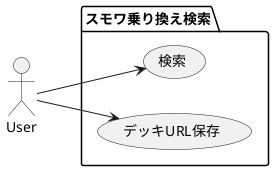
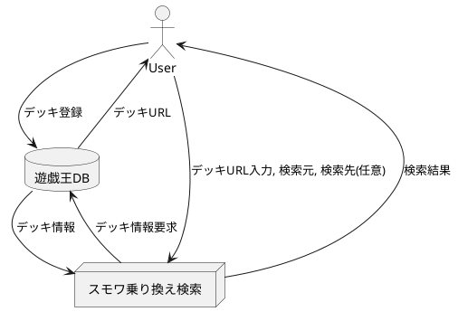
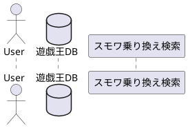
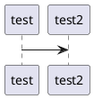

# ygo-small-world-transit

## 要件定義

1. スモールワールドのサーチ先が検索できる
1. 遊戯王DBからデッキレシピを読み込める
1. PC/スマートフォンでの表示に対応
1. デッキURLを保存できる

## データフロー図

## シーケンス図

## クラス図

## フローチャート

## 開発環境

* python
* github
* streamlit
